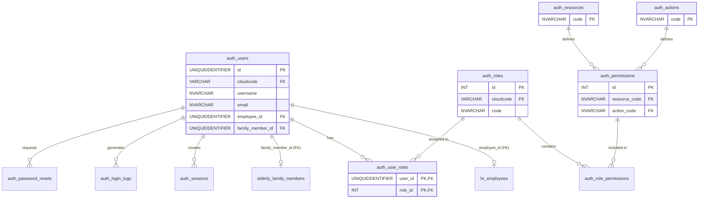

# Đặc tả Phân hệ: `auth` (Bảo mật & Tài khoản)

**Mô tả:** Quản lý tài khoản, phiên đăng nhập, và phân quyền động (Dynamic RBAC) cho người dùng trong hệ thống viện dưỡng lão.

## Sơ đồ quan hệ (ERD)

---

# 1. Bảng `auth.users`

## 1.1. Định nghĩa bảng
Lưu trữ thông tin tài khoản đăng nhập của người dùng trong hệ thống. Đóng vai trò là định danh chính để kiểm soát quyền truy cập, theo dõi các phiên đăng nhập, và ghi nhận lại lịch sử thao tác (Audit) của tất cả các đối tượng: Nhân viên, Quản trị viên, hoặc Người nhà của người cao tuổi.

## 1.2. Cấu trúc bảng
| Cột | Kiểu | Mô tả |
| :--- | :--- | :--- |
| `id` | `UNIQUEIDENTIFIER NOT NULL` | Khóa chính, định danh duy nhất của tài khoản. Dùng `NEWSEQUENTIALID()` để tạo giá trị tăng dần. Tự động sinh khi insert một tài khoản mới. |
| `cloudcode` | `VARCHAR(50) NOT NULL` | Mã viện mà tài khoản này thuộc về. FK tới `common.cloudcode_config`. Bắt buộc nhập khi tạo user; xác định người dùng làm việc cho viện nào. |
| `username` | `NVARCHAR(100) NOT NULL` | Tên đăng nhập (không phân biệt hoa thường tuỳ cơ sở dữ liệu). Được nhập khi tạo user. Kết hợp với `cloudcode` là duy nhất. |
| `password_hash` | `NVARCHAR(255) NOT NULL` | Mật khẩu đã được băm (bcrypt, SHA256,...). Được tạo khi đăng ký hoặc đổi mật khẩu. |
| `email` | `NVARCHAR(255) NOT NULL` | Địa chỉ email liên lạc, cũng dùng để đăng nhập (tuỳ chọn) hoặc nhận link reset pass. Nhập khi tạo user; duy nhất trong cùng `cloudcode`. |
| `employee_id` | `UNIQUEIDENTIFIER NULL` | Liên kết đến bảng `hr.employees` nếu user là nhân viên. Được gán khi tạo tài khoản cho nhân viên (hoặc sau khi nhân viên được tạo). |
| `family_member_id` | `UNIQUEIDENTIFIER NULL` | Liên kết đến bảng `elderly.family_members` nếu user là người thân. Gán khi tạo tài khoản cho người thân của NCT để cấp quyền theo dõi thông tin. |
| `is_active` | `BIT NOT NULL` | Trạng thái hoạt động. `1` = có thể đăng nhập, `0` = bị khóa. Mặc định `1`; được cập nhật khi admin khóa/mở tài khoản. |
| `must_change_password` | `BIT NOT NULL` | Yêu cầu đổi mật khẩu ở lần đăng nhập tiếp theo. Mặc định `0`; được set thành `1` khi hệ thống tạo mật khẩu tạm thời hoặc admin yêu cầu ép đổi pass. |
| `last_login_at` | `DATETIME2 NULL` | Thời điểm đăng nhập thành công gần nhất. Cập nhật mỗi lần hệ thống kiểm tra mật khẩu hợp lệ và sinh token thành công. |
| `created_at` | `DATETIME2 NOT NULL` | Thời điểm tạo tài khoản. Tự động sinh qua `GETDATE()`. |
| `updated_at` | `DATETIME2 NOT NULL` | Lần cuối sửa bất kỳ thông tin nào (kể cả mật khẩu, trạng thái). Tự động cập nhật khi có thay đổi (dùng trigger trong CSDL). |

## 1.3. Nghiệp vụ
- **Khi nào INSERT**: Được thực hiện tự động khi Phòng Hành chính - Nhân sự tạo mới một nhân viên trong hệ thống (gắn với `employee_id`). Hoặc khi Bộ phận Lễ tân tiếp nhận người cao tuổi và đăng ký quyền truy cập App cho người nhà bảo lãnh (gắn với `family_member_id`). Hoặc tạo thủ công bởi Super Admin.
- **Khi nào UPDATE**: 
  - Người dùng thực hiện tính năng Đổi mật khẩu (cập nhật `password_hash`).
  - Quản trị viên chủ động khóa tài khoản khi nhân viên nghỉ việc hoặc có hành vi vi phạm (set `is_active = 0`).
  - Hệ thống tự động ghi nhận thời gian thực khi người dùng gọi API đăng nhập thành công (update `last_login_at`).
  - Quản trị viên ép người dùng đổi mật khẩu khi có rủi ro bảo mật (set `must_change_password = 1`).
- **Khi nào DELETE**: KHÔNG BAO GIỜ thực hiện lệnh xóa vật lý (DELETE) trên bảng này vì nó sẽ phá vỡ toàn vẹn tham chiếu (các bảng Audit, Log đều trỏ về User ID). Nếu muốn vô hiệu hóa, chỉ thực hiện Soft-delete bằng cách cập nhật `is_active = 0`.

## 1.4. Validation
| Tác vụ | Validation | Loại | Giải thích lý do |
| :--- | :--- | :--- | :--- |
| INSERT / UPDATE | `UNIQUE (cloudcode, username)` | Ràng buộc DB (Unique Index) | Ngăn chặn việc tạo ra 2 người dùng có cùng tên đăng nhập trong cùng một viện, đảm bảo định danh khi login. |
| INSERT / UPDATE | `UNIQUE (cloudcode, email)` | Ràng buộc DB (Unique Index) | Một viện không thể có 2 người dùng dùng chung 1 email, tránh lỗi khi dùng email để gửi link reset password hoặc nhận thông báo. |
| INSERT / UPDATE | `(employee_id IS NOT NULL AND family_member_id IS NULL) OR (employee_id IS NULL AND family_member_id IS NOT NULL) OR (employee_id IS NULL AND family_member_id IS NULL)` | Ràng buộc DB (CHECK Constraint) | Đảm bảo tính đa hình (Polymorphic). Tài khoản chỉ có thể thuộc về Nhân viên (loại 1), hoặc Người nhà (loại 2), hoặc Admin độc lập (loại 3). Tuyệt đối không cho phép 1 tài khoản vừa là nhân viên vừa là người nhà. |
| INSERT / UPDATE | `password_hash` không được rỗng, độ dài tối thiểu 60 ký tự (nếu dùng bcrypt) | Application Logic / API Validator | Bắt buộc phải có mật khẩu để bảo mật tài khoản. Việc check độ dài đảm bảo chuỗi lưu trữ đúng là chuỗi đã được mã hóa chứ không phải plaintext. |

---

# 2. Bảng `auth.resources`

## 2.1. Định nghĩa bảng
Danh mục các tài nguyên (thực thể/màn hình) trong hệ thống mà người dùng có thể tương tác (VD: 'employees', 'elderly', 'medical_records'). Đây là dữ liệu dùng chung cấp hệ thống (Master Data), không phân biệt viện.

## 2.2. Cấu trúc bảng
| Cột | Kiểu | Mô tả |
| :--- | :--- | :--- |
| `code` | `VARCHAR(100) NOT NULL` | Khóa chính (PK). Mã kỹ thuật của resource (VD: `EMPLOYEES`, `ELDERLY`). Dùng trực tiếp trong source code (Guard/Middleware) để kiểm tra quyền. |
| `name` | `NVARCHAR(255) NOT NULL` | Tên hiển thị trên giao diện phân quyền (VD: "Quản lý nhân viên", "Quản lý người cao tuổi"). |
| `description` | `NVARCHAR(MAX) NULL` | Giải thích chi tiết hơn về tài nguyên này dùng để làm gì. Dành cho Quản trị viên đọc hiểu khi phân quyền. |
| `order` | `INT NOT NULL` | Thứ tự sắp xếp hiển thị trên giao diện (số nhỏ lên trước). Mặc định là `0`. |
| `is_active` | `BIT NOT NULL` | Trạng thái. `1` = tài nguyên còn sử dụng, `0` = tính năng đã bị ẩn hoặc gỡ bỏ khỏi hệ thống. |
| `created_at` | `DATETIME2 NOT NULL` | Thời gian khởi tạo bản ghi. |
| `updated_at` | `DATETIME2 NOT NULL` | Lần cuối cập nhật thông tin. |

## 2.3. Nghiệp vụ
- **Khi nào INSERT**: Khi đội ngũ phát triển (Dev) phát hành thêm một tính năng mới hoặc một màn hình mới vào hệ thống (Ví dụ: Thêm phân hệ Quản lý Suất ăn `MEALS`), thì sẽ bổ sung thêm một Resource thông qua kịch bản chạy Seed Data.
- **Khi nào UPDATE**: Khi muốn đổi tên hiển thị của tài nguyên cho dễ hiểu hơn, hoặc thay đổi thứ tự (`order`) để hiển thị đẹp hơn trên bảng phân quyền.
- **Khi nào DELETE**: Không bao giờ thực hiện DELETE. Nếu tính năng đó bị khai tử trong hệ thống, chỉ cần cập nhật `is_active = 0`.

## 2.4. Validation
| Tác vụ | Validation | Loại | Giải thích lý do |
| :--- | :--- | :--- | :--- |
| INSERT / UPDATE | `code` phải viết hoa toàn bộ, không có khoảng trắng, chỉ chứa chữ cái, số và dấu gạch dưới `_`. Regex: `^[A-Z0-9_]+$` | Ràng buộc DB (Check Constraint) / API Validation | Mã code này được lập trình viên sử dụng trực tiếp dưới dạng Hằng số (Constants) trong code để bắt quyền. Nếu format sai, code sẽ bị lỗi và không nhận diện được quyền. |

---

# 3. Bảng `auth.actions`

## 3.1. Định nghĩa bảng
Danh mục các hành động cơ bản hoặc thao tác nghiệp vụ có thể thực hiện trên một tài nguyên (VD: `VIEW`, `CREATE`, `UPDATE`, `DELETE`, `APPROVE`, `EXPORT`).

## 3.2. Cấu trúc bảng
| Cột | Kiểu | Mô tả |
| :--- | :--- | :--- |
| `code` | `VARCHAR(50) NOT NULL` | Khóa chính (PK). Mã kỹ thuật của hành động (VD: `VIEW`, `APPROVE`). |
| `name` | `NVARCHAR(100) NOT NULL` | Tên hiển thị trên giao diện (VD: "Xem danh sách", "Chấp thuận"). |
| `description` | `NVARCHAR(255) NULL` | Mô tả chi tiết hành động. |
| `order` | `INT NOT NULL` | Thứ tự ưu tiên hiển thị. Mặc định `0`. (VD: VIEW luôn đứng trước CREATE). |
| `is_active` | `BIT NOT NULL` | `1` = Hành động đang được sử dụng, `0` = Tạm ẩn. |
| `created_at` | `DATETIME2 NOT NULL` | Thời gian tạo. |
| `updated_at` | `DATETIME2 NOT NULL` | Lần cuối cập nhật. |

## 3.3. Nghiệp vụ
- **Khi nào INSERT**: Khi hệ thống sinh ra một loại thao tác mới đặc thù (Ví dụ như: `IMPORT_EXCEL`). Thường được insert thông qua script Seed Data của Dev.
- **Khi nào UPDATE**: Đổi tên hiển thị cho phù hợp với nghiệp vụ.
- **Khi nào DELETE**: Không xóa, chỉ sử dụng `is_active = 0`.

## 3.4. Validation
| Tác vụ | Validation | Loại | Giải thích lý do |
| :--- | :--- | :--- | :--- |
| INSERT / UPDATE | `code` viết hoa toàn bộ, không chứa khoảng trắng. Regex: `^[A-Z_]+$` | Check Constraint | Dùng làm định danh cứng trong Source code. |

---

# 4. Bảng `auth.permissions`

## 4.1. Định nghĩa bảng
Đây là bảng kết nối giữa Tài nguyên (`resources`) và Hành động (`actions`) để sinh ra một Quyền cụ thể có thật trong hệ thống. Ví dụ: `EMPLOYEES` (Tài nguyên) + `CREATE` (Hành động) = Quyền "Được phép tạo mới nhân sự".

## 4.2. Cấu trúc bảng
| Cột | Kiểu | Mô tả |
| :--- | :--- | :--- |
| `id` | `INT NOT NULL` | Khóa chính (PK). Tự động tăng (IDENTITY). Dùng làm khóa ngoại cho bảng gán quyền. |
| `resource_code` | `VARCHAR(100) NOT NULL` | FK trỏ tới `auth.resources(code)`. Tài nguyên chịu tác động. |
| `action_code` | `VARCHAR(50) NOT NULL` | FK trỏ tới `auth.actions(code)`. Loại hành động. |
| `is_enabled` | `BIT NOT NULL` | `1` = Quyền này khả dụng để gán cho Role (Hiển thị checkbox); `0` = Tính năng này đang bảo trì, tạm thời vô hiệu hóa quyền này (Disabled checkbox). |
| `display_name` | `NVARCHAR(100) NULL` | Tên ghi đè hiển thị riêng. Nếu NULL, hệ thống sẽ tự nối tên: `[Tên Action] + [Tên Resource]`. |
| `created_at` | `DATETIME2 NOT NULL` | |

## 4.3. Nghiệp vụ
- **Khi nào INSERT**: Khi lập trình viên phát triển xong chức năng ghép nối (Ví dụ, màn hình Cài đặt hiện tại chỉ hỗ trợ `VIEW` và `UPDATE`, chưa hỗ trợ `CREATE`. Thì Dev sẽ chỉ insert 2 dòng vào bảng này).
- **Khi nào UPDATE**: Khi tính năng gặp lỗi nghiêm trọng, Admin có thể set `is_enabled = 0` để lập tức "cắt" quyền truy cập tính năng này của toàn bộ người dùng trong hệ thống (mà không cần phải đi gỡ quyền của từng Role).
- **Khi nào DELETE**: Không hỗ trợ xóa.

## 4.4. Validation
| Tác vụ | Validation | Loại | Giải thích lý do |
| :--- | :--- | :--- | :--- |
| INSERT / UPDATE | Khóa duy nhất: `UNIQUE(resource_code, action_code)` | Ràng buộc DB (Unique Index) | Ngăn chặn việc tạo ra 2 quyền hoàn toàn giống nhau. Một tài nguyên chỉ có 1 hành động VIEW duy nhất. Tránh việc giao diện phân quyền bị nhân bản checkbox. |

---

# 5. Bảng `auth.roles`

## 5.1. Định nghĩa bảng
Bảng Vai trò (Role) hay còn gọi là Nhóm quyền. Dùng để gom nhóm nhiều quyền (`permissions`) lại với nhau dưới một cái tên (VD: Role `Bác sĩ` sẽ bao gồm các quyền: Xem bệnh án, Sửa bệnh án, Tạo đơn thuốc).

## 5.2. Cấu trúc bảng
| Cột | Kiểu | Mô tả |
| :--- | :--- | :--- |
| `id` | `INT NOT NULL` | Khóa chính (PK). Tự động tăng (IDENTITY). |
| `cloudcode` | `VARCHAR(50) NULL` | Mã viện (FK). Nếu giá trị là `NULL`, đây là Role mẫu của hệ thống cung cấp sẵn. Nếu có mã viện, đây là Role do viện đó tự định nghĩa thêm. |
| `code` | `VARCHAR(50) NOT NULL` | Mã vai trò (VD: `HEAD_NURSE`, `CAREGIVER`). Để định danh. |
| `name` | `NVARCHAR(255) NOT NULL` | Tên vai trò hiển thị trên giao diện (VD: "Điều dưỡng trưởng"). |
| `description` | `NVARCHAR(MAX) NULL` | Mô tả về mục đích của vai trò này. |
| `is_active` | `BIT NOT NULL` | `1` = Role còn sử dụng, `0` = Đã vô hiệu hóa (Không cho phép gán mới Role này vào bất kỳ User nào nữa). |
| `created_at` | `DATETIME2 NOT NULL` | |
| `updated_at` | `DATETIME2 NOT NULL` | |

## 5.3. Nghiệp vụ
- **Khi nào INSERT**: 
  - Hệ thống tự sinh các Role mặc định lúc khởi tạo (cloudcode = NULL).
  - Hoặc Admin của Viện tự tạo thêm Role mới thông qua màn hình "Quản lý Vai trò" để phù hợp với cơ cấu tổ chức riêng.
- **Khi nào UPDATE**: Thay đổi tên Role, sửa đổi mô tả. Vô hiệu hóa Role (set `is_active = 0`) nếu cơ cấu tổ chức thay đổi và vị trí đó không còn tồn tại.
- **Khi nào DELETE**: Chỉ cho phép xóa khi Role đó chưa từng được sử dụng. Nếu đã gán cho bất kỳ user nào thì cấm xóa vật lý.

## 5.4. Validation
| Tác vụ | Validation | Loại | Giải thích lý do |
| :--- | :--- | :--- | :--- |
| INSERT / UPDATE | `UNIQUE (cloudcode, code)` | DB Constraint | Mỗi viện chỉ được tạo 1 Role với mã Code định danh riêng, tránh trùng lặp. Đảm bảo tên Role là duy nhất trong nội bộ viện đó. |
| DELETE | Không cho xóa nếu tồn tại FK trong bảng `user_roles` hoặc `role_permissions` | DB Foreign Key Constraint | Ràng buộc toàn vẹn dữ liệu. Nếu xóa Role, các User đang mang Role đó sẽ gặp lỗi không xác định được nhóm quyền. |

---

# 6. Bảng `auth.role_permissions`

## 6.1. Định nghĩa bảng
Bảng trung gian (Many-to-Many) liên kết Vai trò (`roles`) với các Quyền chi tiết (`permissions`).

## 6.2. Cấu trúc bảng
| Cột | Kiểu | Mô tả |
| :--- | :--- | :--- |
| `role_id` | `INT NOT NULL` | FK trỏ tới `auth.roles(id)`. Cấu thành một nửa PK. |
| `permission_id` | `INT NOT NULL` | FK trỏ tới `auth.permissions(id)`. Cấu thành nửa PK còn lại. |
| `created_at` | `DATETIME2 NOT NULL` | Thời điểm gán quyền vào Role. |
| `created_by` | `UNIQUEIDENTIFIER NULL` | FK trỏ tới `auth.users(id)`. Lưu lại vết (Audit) ai là người thực hiện hành động gán quyền này. |

## 6.3. Nghiệp vụ
- **Khi nào INSERT**: Khi Quản trị viên vào màn hình "Chỉnh sửa Vai trò", thực hiện thao tác TICK chọn vào các ô tính năng (Ví dụ: Tick vào ô "Thêm mới nhân sự") rồi ấn Lưu. Hệ thống sẽ insert dòng tương ứng vào đây.
- **Khi nào UPDATE**: KHÔNG CÓ NGHIỆP VỤ UPDATE. Việc thay đổi quyền bản chất là Xóa quyền cũ đi và Thêm quyền mới vào.
- **Khi nào DELETE**: Khi Quản trị viên BỎ TICK một ô tính năng và ấn Lưu.

## 6.4. Validation
| Tác vụ | Validation | Loại | Giải thích lý do |
| :--- | :--- | :--- | :--- |
| INSERT | Khóa chính phức hợp `PK (role_id, permission_id)` | Ràng buộc DB (Primary Key) | Đảm bảo tuyệt đối 1 Role không bị gán trùng lặp 1 Quyền nhiều lần. |

---

# 7. Bảng `auth.user_roles`

## 7.1. Định nghĩa bảng
Bảng trung gian (Many-to-Many) lưu trữ việc một Người dùng (`users`) đang được gán cho những Vai trò (`roles`) nào.

## 7.2. Cấu trúc bảng
| Cột | Kiểu | Mô tả |
| :--- | :--- | :--- |
| `user_id` | `UNIQUEIDENTIFIER NOT NULL` | FK trỏ tới `auth.users(id)`. |
| `role_id` | `INT NOT NULL` | FK trỏ tới `auth.roles(id)`. |
| `assigned_at` | `DATETIME2 NOT NULL` | Thời gian hệ thống thực hiện phép gán. |
| `assigned_by` | `UNIQUEIDENTIFIER NULL` | FK trỏ tới `auth.users(id)`. Lưu người thực hiện phân quyền. Cực kỳ quan trọng để quy trách nhiệm khi có sự cố lộ lọt dữ liệu. |

## 7.3. Nghiệp vụ
- **Khi nào INSERT**: 
  - Gán tự động (Auto-Mapping): Khi nhân viên được tạo mới/thăng chức bên hệ thống Nhân sự (`hr.employees`), DB Trigger hoặc API Logic sẽ quét bảng `hr.position_role_templates` và tự động INSERT các Role tương ứng vào đây.
  - Gán thủ công: Khi cấp tài khoản cho Người nhà (Role `FAMILY_MEMBER`).
- **Khi nào UPDATE**: KHÔNG CÓ NGHIỆP VỤ UPDATE.
- **Khi nào DELETE**: Khi nhân viên bị giáng chức, luân chuyển công tác, hệ thống tự động gỡ toàn bộ Role cũ (DELETE) để chuẩn bị INSERT bộ Role mới.

## 7.4. Validation
| Tác vụ | Validation | Loại | Giải thích lý do |
| :--- | :--- | :--- | :--- |
| INSERT | Cross-tenant check: `users.cloudcode` PHẢI BẰNG `roles.cloudcode` (Trừ khi `roles.cloudcode` là NULL) | Application Logic / Trigger | Bắt buộc phải kiểm tra ở tầng Code. Không được phép gán Role của Viện A cho nhân sự đang làm việc tại Viện B. Điều này gây rò rỉ phân quyền cực kỳ nghiêm trọng. |
| INSERT | PK `(user_id, role_id)` | DB Constraint (Primary Key) | Ngăn chặn việc cấp 1 Role cho 1 User quá nhiều lần. |

---

# 8. Bảng `auth.sessions`

## 8.1. Định nghĩa bảng
Lưu trữ thông tin về Phiên làm việc. Bản chất là bảng quản lý **Refresh Token**. Giúp hệ thống duy trì đăng nhập cho người dùng mà không bắt họ phải gõ lại mật khẩu liên tục, đồng thời cung cấp khả năng ép "Đăng xuất từ xa" (Revoke).

## 8.2. Cấu trúc bảng
| Cột | Kiểu | Mô tả |
| :--- | :--- | :--- |
| `id` | `UNIQUEIDENTIFIER NOT NULL` | Khóa chính (PK). |
| `cloudcode` | `VARCHAR(50) NOT NULL` | FK. |
| `user_id` | `UNIQUEIDENTIFIER NOT NULL` | FK trỏ tới `auth.users(id)`. Chủ sở hữu phiên đăng nhập. |
| `refresh_token` | `VARCHAR(500) NOT NULL` | Chuỗi token ngẫu nhiên, mã hóa, đủ dài (Dùng JWT hoặc UUID V4 kết hợp). |
| `expires_at` | `DATETIME2 NOT NULL` | Thời điểm Refresh Token hết hạn hoàn toàn (Ví dụ: 30 ngày kể từ lúc tạo). |
| `ip_address` | `VARCHAR(45) NULL` | IP của client gửi request đăng nhập (Lưu cả IPv4 và IPv6). Dùng để dò tìm địa điểm đăng nhập bất thường. |
| `user_agent` | `NVARCHAR(MAX) NULL` | Thông tin Trình duyệt / Hệ điều hành (VD: "Chrome 114 trên Windows 11"). Dùng để hiển thị ở mục "Thiết bị đang đăng nhập". |
| `revoked` | `BIT NOT NULL` | Trạng thái thu hồi. `1` = Bị hủy, `0` = Đang hoạt động. Mặc định `0`. |
| `last_activity` | `DATETIME2 NOT NULL` | Lần cuối cùng Refresh Token này được sử dụng để đổi lấy Access Token mới. |
| `created_at` | `DATETIME2 NOT NULL` | Thời điểm đăng nhập thành công. |

## 8.3. Nghiệp vụ
- **Khi nào INSERT**: Sinh ra 1 record mới khi người dùng nhập đúng Username/Password và đăng nhập thành công ở một thiết bị mới.
- **Khi nào UPDATE**: 
  - Người dùng bấm nút "Đăng xuất" $\rightarrow$ Hệ thống đánh dấu `revoked = 1`.
  - Admin vào quản trị, xem danh sách thiết bị của 1 nhân viên, chọn nút "Kích ra" $\rightarrow$ Đánh dấu `revoked = 1`.
  - User đổi mật khẩu $\rightarrow$ Đánh dấu `revoked = 1` cho TOÀN BỘ các session hiện có của User đó.
  - Người dùng dùng token này để refresh lại phiên $\rightarrow$ Cập nhật `last_activity = GETDATE()`.
- **Khi nào DELETE**: Có một Background Job / Cron Job chạy mỗi ngày vào 2h sáng để DELETE vật lý tất cả các record có `expires_at` đã quá hạn hơn 30 ngày (Dọn rác database).

## 8.4. Validation
| Tác vụ | Validation | Loại | Giải thích lý do |
| :--- | :--- | :--- | :--- |
| INSERT | KHÔNG LƯU ACCESS TOKEN. | Business Logic | Access Token (JWT) có thời hạn ngắn (15p) và tự xác thực bằng chữ ký (Stateless). Việc lưu vào DB làm mất đi bản chất của JWT và gây phình dung lượng DB vô ích. Bảng này chỉ lưu Refresh Token. |
| SELECT (REFRESH) | Token được gửi lên phải có `revoked = 0` VÀ `expires_at > GETDATE()` | Query Logic | Đây là điều kiện tiên quyết để hệ thống chấp nhận cấp phát một Access Token mới. Nếu thiếu 1 trong 2 điều kiện, trả về lỗi `401 Unauthorized`. |
| INSERT / UPDATE | `refresh_token` phải `UNIQUE` | DB Constraint | Đảm bảo tính duy nhất tuyệt đối để đối chiếu chuỗi Token. |

---

# 9. Bảng `auth.login_logs`

## 9.1. Định nghĩa bảng
Bảng Nhật ký (Audit Log) khắt khe nhất hệ thống. Truy vết lại MỌI nỗ lực đăng nhập (dù thành công hay thất bại). Dùng để báo cáo kiểm toán bảo mật và phát hiện các cuộc tấn công dò mật khẩu (Brute-force attack).

## 9.2. Cấu trúc bảng
| Cột | Kiểu | Mô tả |
| :--- | :--- | :--- |
| `id` | `UNIQUEIDENTIFIER NOT NULL` | Khóa chính (PK). |
| `cloudcode` | `VARCHAR(50) NOT NULL` | FK. |
| `user_id` | `UNIQUEIDENTIFIER NULL` | Nếu hệ thống định danh được tài khoản, sẽ điền `user_id` vào đây. Nếu hacker nhập bừa một username không tồn tại, trường này sẽ `NULL`. |
| `username_or_email`| `NVARCHAR(255) NOT NULL` | Bắt lại chính xác giá trị chuỗi mà người dùng đã điền vào ô "Tên đăng nhập" trên màn hình. |
| `success` | `BIT NOT NULL` | `1` = Đăng nhập thành công, `0` = Sai tài khoản hoặc sai mật khẩu. |
| `ip_address` | `VARCHAR(45) NULL` | IP của người cố tình đăng nhập. Rất quan trọng để khóa IP nếu hack nhiều lần. |
| `user_agent` | `NVARCHAR(MAX) NULL` | Trình duyệt được sử dụng. |
| `created_at` | `DATETIME2 NOT NULL` | Thời điểm ghi log. |

## 9.3. Nghiệp vụ
- **Khi nào INSERT**: Được Trigger NGAY LẬP TỨC tại API `/auth/login` bất kể kết quả trả về là `200 OK` hay `401 Unauthorized`.
- **Khi nào UPDATE**: KHÔNG BAO GIỜ. Bảng này áp dụng cơ chế Append-Only (Chỉ được phép ghi thêm).
- **Khi nào DELETE**: KHÔNG BAO GIỜ. Kể cả admin cũng không được xóa để đảm bảo tính khách quan của dữ liệu log kiểm toán.

## 9.4. Validation
| Tác vụ | Validation | Loại | Giải thích lý do |
| :--- | :--- | :--- | :--- |
| UPDATE / DELETE | Chặn mọi câu lệnh `UPDATE` hoặc `DELETE` trên bảng này | DB Trigger (`INSTEAD OF UPDATE, DELETE`) | Ngăn chặn việc nhân viên nội bộ hoặc hacker chiếm quyền thao túng dữ liệu, xóa đi dấu vết đăng nhập trái phép của mình. |

---

# 10. Bảng `auth.password_resets`

## 10.1. Định nghĩa bảng
Lưu trữ và quản lý các yêu cầu khôi phục mật khẩu thông qua Email (Quên mật khẩu). Sử dụng cơ chế cấp phát Token dùng một lần (One-Time Password / Token).

## 10.2. Cấu trúc bảng
| Cột | Kiểu | Mô tả |
| :--- | :--- | :--- |
| `id` | `UNIQUEIDENTIFIER NOT NULL` | Khóa chính (PK). |
| `cloudcode` | `VARCHAR(50) NOT NULL` | FK. |
| `user_id` | `UNIQUEIDENTIFIER NOT NULL` | FK trỏ tới tài khoản yêu cầu reset pass. Việc lưu thẳng `user_id` bảo mật và chính xác hơn là lưu `email`. |
| `token` | `VARCHAR(255) NOT NULL` | Chuỗi mã hóa gửi qua email (VD: `domain.com/reset-pass?token=XYZ...`). |
| `expires_at` | `DATETIME2 NOT NULL` | Thời điểm mã token này mất đi giá trị (Thường được set = `GETDATE() + 15 phút`). |
| `is_used` | `BIT NOT NULL` | Cờ đánh dấu token đã được sử dụng. `1` = Đã dùng đổi pass thành công, `0` = Chưa dùng. Mặc định `0`. |
| `created_at` | `DATETIME2 NOT NULL` | Thời điểm phát sinh yêu cầu. |

## 10.3. Nghiệp vụ
- **Khi nào INSERT**: Người dùng chọn chức năng "Quên mật khẩu", nhập Email hợp lệ và hệ thống gửi Email thành công $\rightarrow$ Insert 1 bản ghi vào đây.
- **Khi nào UPDATE**: Người dùng nhấp vào link trong Email, nhập Mật khẩu mới thành công $\rightarrow$ Cập nhật `is_used = 1`. (Đồng thời cập nhật `password_hash` bên bảng `auth.users`).
- **Khi nào DELETE**: Giống bảng `sessions`, sẽ có Cron Job tự động xóa các bản ghi quá hạn 30 ngày để làm sạch hệ thống.

## 10.4. Validation
| Tác vụ | Validation | Loại | Giải thích lý do |
| :--- | :--- | :--- | :--- |
| SELECT / UPDATE | Chỉ cho phép đổi mật khẩu khi thỏa mãn 2 điều kiện: `is_used = 0` VÀ `expires_at > GETDATE()` | Application Logic | Chặn đứng 2 nguy cơ bảo mật: (1) Token bị đánh cắp dùng đi dùng lại nhiều lần. (2) Token đã hết hiệu lực từ nhiều ngày trước nhưng vẫn bị lợi dụng khai thác. |
| INSERT | `token` phải là `UNIQUE` | DB Constraint | Đảm bảo hệ thống tra cứu và bắt cặp chính xác yêu cầu của User khi họ nhấn vào link đính kèm Token. |
