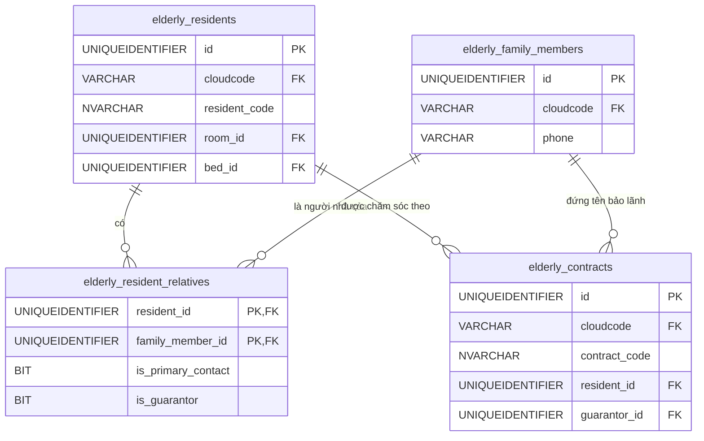

# Đặc tả Phân hệ: `elderly` (Người cao tuổi & Người nhà)

**Mô tả:** Phân hệ cốt lõi quản lý toàn bộ hồ sơ của Người cao tuổi (NCT) đang lưu trú tại viện, thông tin liên hệ của Người nhà (người bảo lãnh), và các Hợp đồng dịch vụ dưỡng lão. Phân hệ này liên kết chặt chẽ với schema `auth` (để cấp tài khoản cho người nhà xem camera/bệnh án) và `facility` (để sắp xếp phòng/giường).

## Sơ đồ quan hệ (ERD)

---

# 1. Bảng `elderly.residents`

## 1.1. Định nghĩa bảng
Hồ sơ gốc của Người cao tuổi (Cụ) đang sinh sống và được chăm sóc tại viện. Chứa các thông tin nhân khẩu học và trạng thái lưu trú hiện tại.

## 1.2. Cấu trúc bảng
| Cột | Kiểu | Mô tả |
| :--- | :--- | :--- |
| `id` | `UNIQUEIDENTIFIER` | Khóa chính, `NEWSEQUENTIALID()`. |
| `cloudcode` | `VARCHAR(50)` | Mã viện, FK. Bắt buộc nhập. |
| `resident_code` | `NVARCHAR(50)` | Mã hồ sơ NCT (VD: `NCT00123`). |
| `first_name` | `NVARCHAR(100)` | Tên của NCT. |
| `last_name` | `NVARCHAR(100)` | Họ và tên đệm. |
| `dob` | `DATE` | Ngày tháng năm sinh. |
| `gender` | `VARCHAR(10)` | Giới tính (`MALE`, `FEMALE`, `OTHER`). |
| `identity_card` | `VARCHAR(20)` | CCCD / CMND. Có thể NULL nếu cụ không còn giấy tờ. |
| `health_insurance_no` | `VARCHAR(50)` | Mã số Bảo hiểm y tế (Rất quan trọng khi đi viện). |
| `address` | `NVARCHAR(255)` | Địa chỉ thường trú. |
| `admission_date` | `DATE` | Ngày nhập viện dưỡng lão. |
| `room_id` | `UNIQUEIDENTIFIER` | FK tới `facility.rooms` (Đang ở phòng nào). |
| `bed_id` | `UNIQUEIDENTIFIER` | FK tới `facility.beds` (Đang nằm giường nào). |
| `status` | `VARCHAR(20)` | `ACTIVE` (Đang ở viện), `HOSPITALIZED` (Đi cấp cứu/nằm viện ngoài), `DISCHARGED` (Đã về nhà), `DECEASED` (Đã mất). |
| `created_at` | `DATETIME2` | Thời gian tạo hồ sơ. |
| `updated_at` | `DATETIME2` | Thời gian cập nhật gần nhất. |

## 1.3. Nghiệp vụ
- **Khi nào INSERT**: Tiếp nhận một cụ mới vào viện dưỡng lão (Sau khi ký hợp đồng).
- **Khi nào UPDATE**: Cụ chuyển phòng/chuyển giường, thay đổi trạng thái sức khỏe đột xuất phải đi viện ngoài (`HOSPITALIZED`), hoặc kết thúc lưu trú.
- **Khi nào DELETE**: Không bao giờ xóa cứng (Hard Delete) hồ sơ y tế/nhân khẩu học. Chỉ đổi `status = DISCHARGED`.

## 1.4. Validation
| Tác vụ | Validation | Loại | Giải thích lý do |
| :--- | :--- | :--- | :--- |
| INSERT/UPDATE | `resident_code` phải UNIQUE trong cùng một `cloudcode`. | DB Constraint (Unique Index) | Tránh nhầm lẫn hồ sơ, dùng để in mã vạch/vòng tay. |
| UPDATE | Nếu `status` chuyển thành `DISCHARGED` hoặc `DECEASED`, phải giải phóng `room_id` và `bed_id` thành `NULL`. | Application/Trigger Logic | Giường trống phải được nhả ra để hệ thống `facility` ghi nhận và đón người mới. |
| INSERT/UPDATE | Kiểm tra `dob` (Ngày sinh) không được lớn hơn ngày hiện tại. | Check Constraint | Đảm bảo tính hợp lý của dữ liệu nhân khẩu học. |

---

# 2. Bảng `elderly.family_members`

## 2.1. Định nghĩa bảng
Lưu trữ thông tin của Người nhà, người giám hộ, hoặc người chịu trách nhiệm thanh toán chi phí cho Người cao tuổi.

## 2.2. Cấu trúc bảng
| Cột | Kiểu | Mô tả |
| :--- | :--- | :--- |
| `id` | `UNIQUEIDENTIFIER` | Khóa chính, `NEWSEQUENTIALID()`. |
| `cloudcode` | `VARCHAR(50)` | Mã viện, FK. |
| `first_name` | `NVARCHAR(100)` | Tên người nhà. |
| `last_name` | `NVARCHAR(100)` | Họ và tên đệm. |
| `phone` | `VARCHAR(20)` | Số điện thoại liên hệ (Rất quan trọng). |
| `email` | `NVARCHAR(255)` | Email (Dùng để nhận hóa đơn, thông báo bệnh án). |
| `identity_card` | `VARCHAR(20)` | Số CCCD/CMND (Để làm hợp đồng pháp lý). |
| `address` | `NVARCHAR(255)` | Địa chỉ thường trú. |
| `is_active` | `BIT` | `1` = Đang liên lạc được. |

## 2.3. Nghiệp vụ
- **Khi nào INSERT**: Khai báo thông tin người nhà lúc làm thủ tục nhập viện cho cụ. *Ghi chú: Khi tạo người nhà, có thể gọi API sang schema `auth` để tự động tạo tài khoản App cho người nhà theo dõi tình hình.*
- **Khi nào UPDATE**: Cập nhật số điện thoại, đổi địa chỉ, email.
- **Khi nào DELETE**: Không xóa cứng.

## 2.4. Validation
| Tác vụ | Validation | Loại | Giải thích lý do |
| :--- | :--- | :--- | :--- |
| INSERT/UPDATE | `phone` phải UNIQUE trong một `cloudcode`. | DB Constraint | SĐT thường dùng làm tài khoản đăng nhập (Username) trên App của người nhà. |
| INSERT | Bắt buộc phải có `phone` hoặc `identity_card`. | Check Constraint | Phải có thông tin định danh để liên lạc khẩn cấp hoặc chịu trách nhiệm pháp lý. |

---

# 3. Bảng `elderly.resident_relatives`

## 3.1. Định nghĩa bảng
Bảng quan hệ N-N (Many-to-Many) giữa Cụ (Resident) và Người nhà (Family Member). Một cụ có thể có nhiều con cháu, và một người nhà có thể gửi cả Bố lẫn Mẹ vào viện.

## 3.2. Cấu trúc bảng
| Cột | Kiểu | Mô tả |
| :--- | :--- | :--- |
| `resident_id` | `UNIQUEIDENTIFIER` | FK tới `elderly.residents.id`. (Cấu thành PK). |
| `family_member_id` | `UNIQUEIDENTIFIER` | FK tới `elderly.family_members.id`. (Cấu thành PK). |
| `relationship` | `NVARCHAR(100)` | Mối quan hệ (VD: "Con trai", "Con gái", "Vợ", "Anh ruột"). |
| `is_primary_contact` | `BIT` | `1` = Người liên hệ đầu tiên khi có cấp cứu/khẩn cấp. |
| `is_guarantor` | `BIT` | `1` = Người bảo lãnh, chịu trách nhiệm ký giấy tờ và thanh toán. |

## 3.3. Nghiệp vụ
- **Khi nào INSERT**: Gắn (map) người nhà vào hồ sơ của cụ.
- **Khi nào UPDATE**: Thay đổi người liên hệ chính (`is_primary_contact`) hoặc người bảo lãnh.
- **Khi nào DELETE**: Xóa liên kết nếu khai báo sai.

## 3.4. Validation
| Tác vụ | Validation | Loại | Giải thích lý do |
| :--- | :--- | :--- | :--- |
| INSERT/UPDATE | Với mỗi `resident_id`, chỉ được phép có tối đa MỘT (1) người là `is_primary_contact = 1`. | Application Logic / Filtered Index | Đảm bảo hệ thống biết chính xác số điện thoại nào sẽ được gọi tự động đầu tiên khi bấm nút Panic Button. |

---

# 4. Bảng `elderly.contracts`

## 4.1. Định nghĩa bảng
Quản lý hợp đồng dịch vụ lưu trú và chăm sóc được ký kết giữa Viện dưỡng lão và Người bảo lãnh.

## 4.2. Cấu trúc bảng
| Cột | Kiểu | Mô tả |
| :--- | :--- | :--- |
| `id` | `UNIQUEIDENTIFIER` | Khóa chính, `NEWSEQUENTIALID()`. |
| `cloudcode` | `VARCHAR(50)` | Mã viện, FK. |
| `contract_code` | `NVARCHAR(50)` | Mã hợp đồng (VD: `HD2023-001`). |
| `resident_id` | `UNIQUEIDENTIFIER` | FK tới `elderly.residents.id`. (Ai được chăm sóc). |
| `guarantor_id` | `UNIQUEIDENTIFIER` | FK tới `elderly.family_members.id`. (Ai ký tên/thanh toán). |
| `start_date` | `DATE` | Ngày bắt đầu tính phí dịch vụ. |
| `end_date` | `DATE` | Ngày hết hạn hợp đồng (Có thể NULL nếu ký vô thời hạn). |
| `base_price` | `DECIMAL(18,2)` | Phí chăm sóc cơ bản theo tháng (Trước khi cộng các dịch vụ phát sinh). |
| `status` | `VARCHAR(20)` | Trạng thái: `DRAFT` (Nháp), `ACTIVE` (Đang hiệu lực), `EXPIRED` (Hết hạn), `TERMINATED` (Thanh lý/Hủy). |
| `notes` | `NVARCHAR(MAX)` | Ghi chú thêm về chế độ ăn/chăm sóc đặc biệt ghi trong hợp đồng. |

## 4.3. Nghiệp vụ
- **Khi nào INSERT**: Lễ tân/Sale tạo hợp đồng khi chốt khách.
- **Khi nào UPDATE**: Gia hạn hợp đồng (Đổi `end_date`), hoặc thanh lý hợp đồng (`status = TERMINATED`).
- **Khi nào DELETE**: Chỉ được xóa cứng nếu hợp đồng đang ở trạng thái `DRAFT` (Nháp chưa ký). Nếu đã `ACTIVE` thì cấm xóa.

## 4.4. Validation
| Tác vụ | Validation | Loại | Giải thích lý do |
| :--- | :--- | :--- | :--- |
| INSERT/UPDATE | `end_date` phải lớn hơn hoặc bằng `start_date`. | Check Constraint | Logic thời gian cơ bản của hợp đồng. |
| DELETE | Không cho phép xóa nếu `status != 'DRAFT'`. | Application Logic | Hồ sơ tài chính/pháp lý đã ký là không thể xóa bỏ để đảm bảo đối soát kế toán. |
