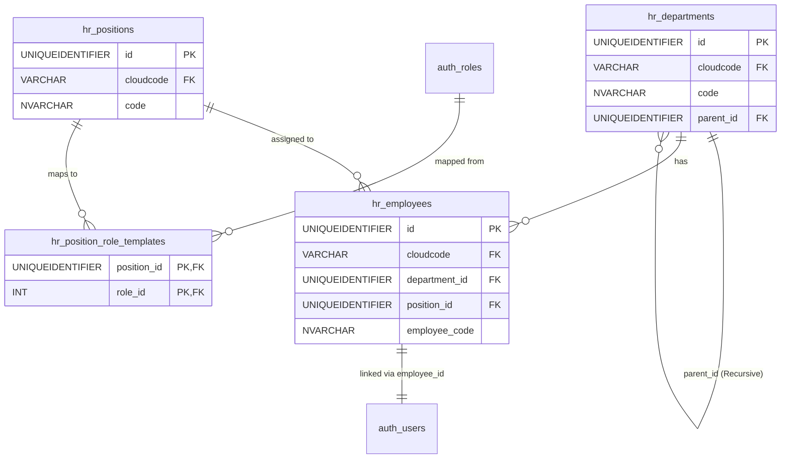

# Đặc tả Phân hệ: `hr` (Nhân sự)

**Mô tả:** Quản lý sơ đồ cơ cấu tổ chức (Phòng ban), Chức vụ, và Hồ sơ nhân sự cốt lõi của Viện dưỡng lão. Điểm khác biệt quan trọng nhất của phân hệ này là **sự móc nối trực tiếp với hệ thống bảo mật (`auth`)** thông qua cơ chế tự động phân quyền theo chức vụ (Auto-Mapping Role).

## Sơ đồ quan hệ (ERD)

---

# 1. Bảng `hr.departments`

## 1.1. Định nghĩa bảng
Lưu trữ thông tin chi tiết về Cơ cấu tổ chức của Viện. Bao gồm các Khối, Khoa, Phòng Ban, và Tổ chuyên môn. Bảng này được thiết kế theo cấu trúc **Cây đệ quy (Tree / Hierarchical)** để có thể lồng ghép nhiều cấp bậc quản lý (Ví dụ: Ban Giám Đốc $\rightarrow$ Khối Chăm Sóc $\rightarrow$ Khoa Y Tế $\rightarrow$ Tổ Điều Dưỡng).

## 1.2. Cấu trúc bảng
| Cột | Kiểu | Mô tả |
| :--- | :--- | :--- |
| `id` | `UNIQUEIDENTIFIER NOT NULL` | Khóa chính (PK). Dùng `NEWSEQUENTIALID()` để cấp phát tự động và đảm bảo hiệu năng khi lưu trữ cây. |
| `cloudcode` | `VARCHAR(50) NOT NULL` | Khóa ngoại (FK) trỏ tới `cloudcode_config`. Đánh dấu phòng ban này thuộc về Viện nào trên hệ thống đa chi nhánh. |
| `code` | `VARCHAR(50) NOT NULL` | Mã phòng ban (VD: `PB_NHAN_SU`, `KHOA_Y_TE`). Rất quan trọng để nhận diện khi viết báo cáo hoặc thống kê. |
| `name` | `NVARCHAR(255) NOT NULL` | Tên đầy đủ của Phòng ban / Khoa (VD: "Khoa Chăm Sóc Tích Cực"). |
| `parent_id` | `UNIQUEIDENTIFIER NULL` | Khóa ngoại (FK) trỏ về chính bảng `departments(id)`. Xác định đơn vị quản lý cấp trên trực tiếp. Nếu bằng `NULL`, đây là đơn vị cấp cao nhất (Root). |
| `is_active` | `BIT NOT NULL` | Trạng thái phòng ban. `1` = Đang hoạt động, `0` = Đã giải thể / sáp nhập. Mặc định `1`. |
| `created_at` | `DATETIME2 NOT NULL` | Thời điểm khởi tạo phòng ban trên phần mềm. |
| `updated_at` | `DATETIME2 NOT NULL` | Lần chỉnh sửa thông tin gần nhất. |

## 1.3. Nghiệp vụ
- **Khi nào INSERT**: Được tạo khi Viện dưỡng lão bắt đầu khởi tạo trên phần mềm và bắt đầu vẽ Sơ đồ cơ cấu tổ chức, hoặc khi Viện mở rộng thêm các Khoa/Phòng mới.
- **Khi nào UPDATE**: Thay đổi tên Phòng ban, hoặc thực hiện nghiệp vụ "Điều chuyển khối": Ví dụ Tổ Điều Dưỡng đang thuộc Khoa Dịch vụ, nay được chuyển sang trực thuộc Khoa Y tế (cập nhật lại `parent_id`). Nếu phòng ban đó bị giải thể, thực hiện cập nhật `is_active = 0`.
- **Khi nào DELETE**: KHÔNG BAO GIỜ xóa vật lý các phòng ban đã từng hoạt động, để đảm bảo lịch sử công tác của các nhân viên cũ không bị mất dữ liệu. Chỉ xóa vật lý (Hard delete) khi người dùng vừa tạo nhầm một phòng ban và trong phòng đó chưa có nhân viên nào.

## 1.4. Validation
| Tác vụ | Validation | Loại | Giải thích lý do |
| :--- | :--- | :--- | :--- |
| INSERT / UPDATE | `UNIQUE (cloudcode, code)` | DB Constraint (Unique Index) | Đảm bảo tính duy nhất của Mã phòng ban trong nội bộ Viện để phục vụ truy xuất dữ liệu độc lập. |
| UPDATE | `parent_id` KHÔNG ĐƯỢC trỏ lại chính `id` của bản thân bản ghi đó. Đồng thời phải kiểm tra vòng lặp vô hạn (Circular Reference: A là con B, B lại là con A). | Application Logic / CCTE (CTE đệ quy SQL) | Ngăn chặn lỗi treo hệ thống hoặc lỗi Stack Overflow khi Frontend vẽ sơ đồ cây tổ chức. |
| DELETE | Không cho phép xóa vật lý (DELETE) nếu bảng `hr.employees` vẫn còn dữ liệu trỏ vào `department_id` này. | Ràng buộc Khóa Ngoại (Foreign Key) | Bảo vệ toàn vẹn tham chiếu. |

---

# 2. Bảng `hr.positions`

## 2.1. Định nghĩa bảng
Danh mục quản lý các Chức danh / Vị trí công tác (Job Titles) trong Viện dưỡng lão. Chức vụ là yếu tố cực kỳ quan trọng, đóng vai trò "chìa khóa" để hệ thống tự động nhận diện và cấp đúng quyền hạn trên phần mềm cho từng nhân viên.

## 2.2. Cấu trúc bảng
| Cột | Kiểu | Mô tả |
| :--- | :--- | :--- |
| `id` | `UNIQUEIDENTIFIER NOT NULL` | Khóa chính (PK). Tự động sinh `NEWSEQUENTIALID()`. |
| `cloudcode` | `VARCHAR(50) NOT NULL` | Mã định danh Viện (FK). |
| `code` | `VARCHAR(50) NOT NULL` | Mã chức vụ kỹ thuật (VD: `HEAD_NURSE`, `ACCOUNTANT`, `DOCTOR_01`). |
| `name` | `NVARCHAR(255) NOT NULL` | Tên gọi hành chính của chức vụ (VD: "Điều dưỡng trưởng", "Kế toán viên"). |
| `description` | `NVARCHAR(MAX) NULL` | Mô tả về phạm vi trách nhiệm (Job Description - JD) của vị trí này. |
| `is_active` | `BIT NOT NULL` | `1` = Chức vụ đang được tuyển dụng / sử dụng. `0` = Chức danh này đã bị loại bỏ khỏi cơ cấu (không được phép bổ nhiệm mới nhân viên vào vị trí này). |
| `created_at` | `DATETIME2 NOT NULL` | |
| `updated_at` | `DATETIME2 NOT NULL` | |

## 2.3. Nghiệp vụ
- **Khi nào INSERT**: Tổ chức có chức danh công tác mới.
- **Khi nào UPDATE**: Thay đổi tên gọi của chức danh hoặc cập nhật mô tả công việc. Hủy bỏ chức danh (`is_active = 0`).
- **Khi nào DELETE**: Chỉ cho phép xóa khi chức danh đó chưa có ai đảm nhiệm bao giờ. Nếu đã có nhân viên từng nắm giữ, chỉ được phép ngưng kích hoạt.

## 2.4. Validation
| Tác vụ | Validation | Loại | Giải thích lý do |
| :--- | :--- | :--- | :--- |
| INSERT / UPDATE | `UNIQUE (cloudcode, code)` | DB Constraint | Tránh nhầm lẫn khi cấu hình lương hoặc cấu hình quyền tự động. |
| DELETE | Ràng buộc bảng `hr.employees`. | DB FK Constraint | Không thể xóa ghế nếu đang có người ngồi (hoặc từng ngồi). |

---

# 3. Bảng `hr.employees`

## 3.1. Định nghĩa bảng
Bảng trọng tâm nhất của hệ thống Nhân sự (HR Core). Lưu trữ toàn bộ hồ sơ nhân thân, thông tin liên lạc và trạng thái công tác của người lao động. Mỗi khi 1 bản ghi được tạo ở đây, hệ thống sẽ tự động móc nối sang hệ thống Bảo mật (`auth`) để cấp một tài khoản đăng nhập cho nhân viên đó.

## 3.2. Cấu trúc bảng
| Cột | Kiểu | Mô tả |
| :--- | :--- | :--- |
| `id` | `UNIQUEIDENTIFIER NOT NULL` | Khóa chính (PK). Sinh tự động `NEWSEQUENTIALID()`. Sẽ được hệ thống `auth.users` lấy làm giá trị nối vào cột `employee_id`. |
| `cloudcode` | `VARCHAR(50) NOT NULL` | FK. Viện chủ quản. |
| `employee_code` | `VARCHAR(50) NOT NULL` | Mã số nhân viên (Mã NV - VD: `NV230001`). Phục vụ chấm công, in thẻ. |
| `first_name` | `NVARCHAR(100) NOT NULL` | Tên gọi của nhân viên. Dùng để xưng hô trên hệ thống. |
| `last_name` | `NVARCHAR(100) NOT NULL` | Họ và tên đệm. |
| `phone` | `VARCHAR(20) NOT NULL` | Số điện thoại cá nhân. Bắt buộc nhập để liên hệ. |
| `email` | `VARCHAR(255) NOT NULL` | Email công việc hoặc cá nhân. Dùng làm đầu vào để hệ thống tạo `username` đăng nhập. |
| `department_id` | `UNIQUEIDENTIFIER NOT NULL` | FK trỏ tới `hr.departments(id)`. Xác định nhân viên đang ngồi tại phòng/khoa nào. |
| `position_id` | `UNIQUEIDENTIFIER NOT NULL` | FK trỏ tới `hr.positions(id)`. Xác định nhân viên này đang làm chức vụ gì. Rất quan trọng để sinh quyền. |
| `status` | `VARCHAR(20) NOT NULL` | Trạng thái công tác: `ACTIVE` (Đang làm việc bình thường), `ON_LEAVE` (Nghỉ thai sản/ốm đau dài hạn), `RESIGNED` (Đã nghỉ việc). |
| `join_date` | `DATE NOT NULL` | Ngày bắt đầu ký hợp đồng lao động / Ngày vào làm. |
| `resign_date` | `DATE NULL` | Ngày chính thức nghỉ việc (chốt sổ). |
| `created_at` | `DATETIME2 NOT NULL` | |
| `updated_at` | `DATETIME2 NOT NULL` | |

## 3.3. Nghiệp vụ (Với tự động hóa liên ranh giới)
- **Khi nào INSERT**: Lễ tân hoặc HR nhập liệu hồ sơ nhân sự mới.
  - *Trigger tự động*: Ngay sau khi lưu thông tin nhân viên thành công, hệ thống Background Worker sẽ:
    1. Tạo một tài khoản trong bảng `auth.users` với `username` là `email` và mật khẩu mặc định.
    2. Quét bảng `position_role_templates` để xem chức vụ (`position_id`) của người này ứng với những quyền gì, sau đó bơm toàn bộ quyền đó vào bảng `auth.user_roles`.
- **Khi nào UPDATE**: Cập nhật phòng ban, thay đổi chức vụ, cập nhật trạng thái nghỉ việc.
  - *Trigger tự động 1 (Thuyên chuyển)*: Nếu `position_id` bị thay đổi, hệ thống xóa trắng bảng phân quyền cũ `auth.user_roles` và nạp lại quyền của chức vụ mới.
  - *Trigger tự động 2 (Nghỉ việc)*: Nếu `status` chuyển thành `RESIGNED`, hệ thống tự động khóa tài khoản `is_active = 0` ở `auth.users` để nhân viên không thể đăng nhập lấy cắp dữ liệu.
- **Khi nào DELETE**: KHÔNG BAO GIỜ. Cấm xóa hồ sơ nhân viên để lưu vết kế toán tiền lương và lịch sử pháp lý.

## 3.4. Validation
| Tác vụ | Validation | Loại | Giải thích lý do |
| :--- | :--- | :--- | :--- |
| INSERT / UPDATE | `UNIQUE (cloudcode, employee_code)` | DB Constraint | Mỗi người phải có 1 mã định danh chấm công duy nhất. |
| UPDATE | Nếu cập nhật `status = 'RESIGNED'`, bắt buộc cột `resign_date` (Ngày nghỉ việc) KHÔNG ĐƯỢC BỎ TRỐNG. | DB Check Constraint / Application Logic | Buộc phòng HR phải nhập ngày nghỉ chính xác để kết xuất dữ liệu chốt bảo hiểm và tính lương tháng cuối. |
| INSERT / UPDATE | `email` phải chuẩn định dạng RFC và không được trùng lặp. | Application Logic | Vì dùng làm tài khoản đăng nhập. |

---

# 4. Bảng `hr.position_role_templates`

## 4.1. Định nghĩa bảng
Đây là "bộ não" của cơ chế **Auto-Mapping Role** (Cấp quyền tự động theo chức vụ). Bảng này lưu trữ quy tắc ánh xạ: "Nếu một người giữ chức danh A, thì họ mặc định có nhóm quyền (Role) gì bên hệ thống Bảo mật".

## 4.2. Cấu trúc bảng
| Cột | Kiểu | Mô tả |
| :--- | :--- | :--- |
| `position_id` | `UNIQUEIDENTIFIER NOT NULL` | Khóa ngoại (FK) trỏ về `hr.positions(id)`. Cấu thành nửa Khóa chính (PK). |
| `role_id` | `INT NOT NULL` | Khóa ngoại (FK) trỏ sang `auth.roles(id)`. Cấu thành nửa Khóa chính còn lại. Việc lưu ID Int giúp query cực nhanh. |

## 4.3. Nghiệp vụ
- **Khi nào INSERT**: Được thực hiện bởi Quản trị viên Nhân sự trên một màn hình Cấu hình đặc biệt. Họ sẽ thiết lập ví dụ: "Vị trí Bác sĩ Trưởng Khoa" sẽ được map với 2 Roles: "Bác Sĩ (Quyền Y Tế)" và "Trưởng Phòng (Quyền HR xem ngày công của nhân viên cấp dưới)".
- **Khi nào UPDATE**: Không có Update. Cơ chế là Xóa cũ - Ghi mới.
- **Khi nào DELETE**: Khi tổ chức quyết định tước một đặc quyền ra khỏi một chức vụ cụ thể.
  - *Lưu ý quan trọng*: Bất cứ khi nào bảng này bị thay đổi (Insert hoặc Delete), hệ thống bắt buộc phải chạy một Job ngầm để quét lại TOÀN BỘ các nhân viên đang sở hữu `position_id` bị thay đổi đó, và thực hiện đồng bộ lại quyền (Re-sync) trong bảng `auth.user_roles`.

## 4.4. Validation
| Tác vụ | Validation | Loại | Giải thích lý do |
| :--- | :--- | :--- | :--- |
| INSERT | Khóa chính phức hợp `PK(position_id, role_id)` | DB Constraint | Không thể thêm lặp 1 Role cho 1 Chức vụ hai lần. |
| TẤT CẢ | Cơ chế đồng bộ (Sync) bắt buộc phải có Transaction | Database Transaction | Nếu việc đồng bộ quyền cho hàng trăm nhân viên sau khi sửa Template này bị lỗi giữa chừng, toàn bộ tiến trình phải bị Rollback để tránh tình trạng "người mất quyền, người còn quyền". |
